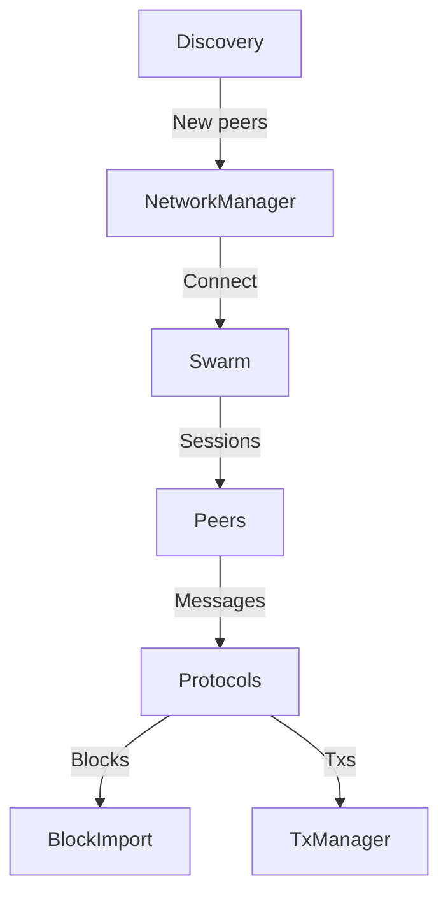

# Lesson 12: P2P Networking Overview

*"The worthwhile problems are the ones you can really solve or help solve, the ones you can really contribute something to." - Richard Feynman*

## Files with Inline Comments for This Lesson
- `crates/net/network/src/lib.rs` - Main networking module
- `crates/net/network/src/manager.rs` - Network manager implementation
- `crates/net/discv4/src/lib.rs` - Discovery v4 protocol
- `crates/net/eth-wire/src/protocol.rs` - Ethereum wire protocol

## The Ethereum P2P Network: A Global Nervous System

### The Deep WHY: Why P2P Networks for Blockchain?

Imagine you're organizing a global treasure hunt where:
- **No single authority** can control the rules or results
- **Participants** must verify each other's claims
- **Information** must spread quickly to all participants
- **Bad actors** exist and will try to cheat

This is exactly why blockchain needs P2P networks! Traditional client-server models have a single point of failure, but blockchains need **decentralization**, **censorship resistance**, and **trustless verification**.

**The Three-Layer Architecture:**

Ethereum's P2P network is like a sophisticated communication system with three layers:

1. **Discovery Layer**: Finding peers (UDP-based) - *Like a phone directory*
2. **Transport Layer**: Encrypted connections (TCP-based) - *Like secure phone lines*
3. **Application Layer**: Protocol messages (blocks, transactions) - *Like the actual conversations*

### Why This Specific Stack?

**Real-World Analogy**: Think of it like organizing a neighborhood watch:
- **Discovery**: How do you find other neighbors who want to participate?
- **Transport**: How do you communicate securely so bad actors can't eavesdrop?
- **Application**: What specific information do you share and how?

## The Protocol Stack

### Layer 1: Node Discovery (discv4) - The Neighborhood Directory

**The Core Problem**: In a decentralized network, how do you find other participants?

**Real-World Analogy**: Imagine moving to a new city. You need to:
1. **Find neighbors** who share your interests
2. **Get recommendations** from people you trust
3. **Remember** who you've met before
4. **Organize contacts** so you can find them again

This is exactly what node discovery does!

```rust
pub struct Discv4Service {
    /// Our node's identity (like your phone number)
    local_id: PeerId,
    /// Kademlia routing table (like your contact list)
    kbuckets: KBucketsTable<NodeKey, NodeRecord>,
    /// UDP socket for discovery (like a radio for broadcasting)
    socket: UdpSocket,
    /// Known bootstrap nodes (like mutual friends who introduce you)
    bootstrap_nodes: Vec<NodeRecord>,
}
```

**Key Concepts Explained:**

1. **Node ID**: Like a permanent phone number, generated from your public key
   ```rust
   // Your identity is derived from your private key
   let private_key = SecretKey::new(&mut rng);
   let node_id = NodeId::from_public_key(&private_key.public_key());
   ```

2. **XOR Distance**: A clever way to organize the network
   ```rust
   // XOR distance creates a "metric space" where:
   // - Close nodes are "similar" in the network
   // - Every node sees the network differently
   // - Searches converge quickly
   fn distance(a: &NodeId, b: &NodeId) -> U256 {
       // XOR creates a balanced binary tree structure
       let mut result = [0u8; 32];
       for i in 0..32 {
           result[i] = a.0[i] ^ b.0[i]; // Bitwise XOR
       }
       U256::from_be_bytes(result)
   }
   ```

3. **K-buckets**: Like organizing your contacts by how "close" they are
   - Bucket 0: Your immediate neighbors (distance 0-1)
   - Bucket 1: Nearby nodes (distance 2-3)
   - Bucket 255: Distant nodes (distance 2^255-2^256)

**Why This Design Works:**
- **Scalable**: Even with millions of nodes, you only need to know ~256 * 16 = 4,096 peers
- **Efficient**: Finding any node takes only log(N) hops
- **Resilient**: No single point of failure
- **Self-healing**: Network automatically repairs itself

### Layer 2: RLPx Transport - The Secure Phone Line

**The Core Problem**: How do you establish secure, authenticated communication channels?

**Real-World Analogy**: Think of it like setting up a secure phone call:
1. **Dial the number** (establish TCP connection)
2. **Prove your identity** (cryptographic handshake)
3. **Agree on encryption** (negotiate security parameters)
4. **Start talking** (exchange encrypted messages)

But unlike a phone call, this is cryptographically secure against eavesdroppers!

```rust
pub struct RLPxSession {
    /// Remote peer's ID (like caller ID, but cryptographically verified)
    remote_id: PeerId,
    /// Encryption state (like a secure codec)
    cipher: Aes256Ctr,
    /// MAC for authentication (like a tamper-proof seal)
    mac: Keccak256,
    /// Negotiated capabilities (like agreed conversation topics)
    capabilities: Vec<Capability>,
}
```

**The Handshake Process - A Cryptographic Dance:**

1. **Auth message**: "Hi, I'm Alice. Here's my encrypted challenge."
   ```rust
   // Initiator creates auth message
   let auth = AuthMessage {
       signature: sign_challenge(&ephemeral_key, &static_key),
       public_key: our_ephemeral_public,
       nonce: random_nonce(),
   };
   ```

2. **Auth ACK**: "Hi Alice, I'm Bob. Here's proof I got your challenge."
   ```rust
   // Responder verifies and responds
   let auth_ack = AuthAck {
       public_key: their_ephemeral_public,
       nonce: response_nonce(),
   };
   ```

3. **Hello**: "I can speak ETH protocol version 68. What about you?"
   ```rust
   // Both sides exchange capabilities
   let hello = HelloMessage {
       capabilities: vec![Capability::Eth { version: 68 }],
       client_id: "reth".to_string(),
       listen_port: 30303,
   };
   ```

4. **Protocol messages**: Now we can safely exchange blocks and transactions

**Why This Complexity?**
- **Authentication**: Prevents man-in-the-middle attacks
- **Encryption**: Prevents eavesdropping on transaction data
- **Forward Secrecy**: Even if keys are compromised later, past messages stay secure
- **Capability Negotiation**: Ensures both sides speak the same protocols

### Layer 3: Capability Protocols - The Specialized Conversations

**The Core Idea**: Different types of data need different handling protocols.

**Real-World Analogy**: Think of it like specialized radio channels:
- **Emergency Channel**: Critical updates (new blocks)
- **Traffic Channel**: Regular updates (transactions)
- **Weather Channel**: Background info (state sync)

Each protocol is optimized for its specific use case!

```rust
pub enum Capability {
    /// Ethereum wire protocol (the main blockchain channel)
    Eth { version: u8 },
    /// State snapshot protocol (the fast-sync channel)
    Snap { version: u8 },
    /// Whisper protocol (deprecated messaging)
    Shh { version: u8 },
}
```

**Why Multiple Protocols?**

1. **ETH Protocol**: For consensus-critical data
   - Blocks must be propagated immediately
   - Transactions need efficient flooding
   - Headers need fast validation

2. **SNAP Protocol**: For fast synchronization
   - State snapshots are huge (gigabytes)
   - Need compression and checksums
   - Can tolerate slower delivery

3. **Specialization Benefits**:
   - **Performance**: Each protocol optimized for its data type
   - **Compatibility**: Nodes can support different protocol versions
   - **Evolution**: New protocols can be added without breaking existing ones

## The Network Manager

The `NetworkManager` orchestrates all networking components:

```rust
pub struct NetworkManager<N: NetworkPrimitives> {
    /// Manages peer connections
    swarm: Swarm<N>,
    /// External interface
    handle: NetworkHandle<N>,
    /// Block import logic
    block_import: Box<dyn BlockImport>,
    /// Transaction propagation
    to_transactions_manager: Option<Sender<NetworkTransactionEvent>>,
    /// Request handling
    to_eth_request_handler: Option<Sender<IncomingEthRequest>>,
}
```

### Component Interaction



## Discovery Protocol (discv4)

### Kademlia-like DHT

Nodes are organized by XOR distance:

```rust
fn distance(a: &NodeId, b: &NodeId) -> U256 {
    // XOR distance in 256-bit space
    let mut result = [0u8; 32];
    for i in 0..32 {
        result[i] = a.0[i] ^ b.0[i];
    }
    U256::from_be_bytes(result)
}
```

### K-Buckets Structure

```rust
pub struct KBucketsTable<K, V> {
    /// Buckets organized by distance
    buckets: Vec<KBucket<K, V>>,
    /// Our local key
    local_key: K,
}

pub struct KBucket<K, V> {
    /// Nodes in this bucket (max 16)
    nodes: Vec<Node<K, V>>,
    /// Replacement cache
    replacements: Vec<Node<K, V>>,
}
```

Each bucket holds nodes at a specific distance range:
- Bucket 0: Distance 2^0 to 2^1
- Bucket 1: Distance 2^1 to 2^2
- ...
- Bucket 255: Distance 2^255 to 2^256

### Discovery Messages

```rust
pub enum Message {
    /// Verify node is alive
    Ping {
        from: Endpoint,
        to: Endpoint,
        expire: u64,
    },
    
    /// Response to ping
    Pong {
        to: Endpoint,
        echo: B256,
        expire: u64,
    },
    
    /// Request nodes near target
    FindNode {
        target: NodeId,
        expire: u64,
    },
    
    /// Response with nodes
    Neighbours {
        nodes: Vec<NodeRecord>,
        expire: u64,
    },
}
```

### Discovery Algorithm

```rust
impl Discv4Service {
    /// Lookup nodes close to target
    async fn lookup(&mut self, target: NodeId) -> Vec<NodeRecord> {
        let mut queried = HashSet::new();
        let mut results = Vec::new();
        
        // Start with closest known nodes
        let mut to_query = self.kbuckets.closest_nodes(&target, ALPHA);
        
        while !to_query.is_empty() {
            // Query ALPHA nodes in parallel
            let futures = to_query.iter()
                .filter(|n| !queried.contains(&n.id))
                .take(ALPHA)
                .map(|node| self.find_node(node, target));
            
            // Collect responses
            let responses = join_all(futures).await;
            
            for nodes in responses {
                for node in nodes {
                    let distance = distance(&node.id, &target);
                    results.push((distance, node));
                }
            }
            
            // Sort by distance
            results.sort_by_key(|(d, _)| *d);
            results.truncate(K);
            
            // Update nodes to query
            to_query = results.iter()
                .map(|(_, n)| n.clone())
                .filter(|n| !queried.contains(&n.id))
                .collect();
            
            queried.extend(to_query.iter().map(|n| n.id));
        }
        
        results.into_iter().map(|(_, n)| n).collect()
    }
}
```

## RLPx Protocol

### Handshake

```rust
pub struct RLPxHandshake {
    /// Our ephemeral key for ECDH
    ephemeral_key: SecretKey,
    /// Remote's ephemeral public key
    remote_ephemeral: Option<PublicKey>,
    /// Shared secrets after ECDH
    secrets: Option<Secrets>,
}

impl RLPxHandshake {
    /// Initiator sends auth message
    fn create_auth(&self) -> AuthMessage {
        let shared_secret = ecdh(&self.ephemeral_key, &remote_public);
        let signature = sign(&shared_secret, &self.static_key);
        
        AuthMessage {
            signature,
            public_key: self.ephemeral_public(),
            nonce: random_nonce(),
        }
    }
    
    /// Responder verifies and responds
    fn handle_auth(&mut self, auth: AuthMessage) -> Result<AuthAck> {
        // Verify signature
        let shared_secret = ecdh(&self.ephemeral_key, &auth.public_key);
        verify_signature(&auth.signature, &shared_secret)?;
        
        // Generate response
        Ok(AuthAck {
            public_key: self.ephemeral_public(),
            nonce: random_nonce(),
        })
    }
}
```

### Message Framing

```rust
pub struct Frame {
    /// Frame header (encrypted)
    header: [u8; 32],
    /// Frame body (encrypted)
    body: Vec<u8>,
}

impl Frame {
    fn encode(msg: &Message, secrets: &Secrets) -> Self {
        // Create header
        let header = FrameHeader {
            body_size: msg.len() as u32,
            protocol_id: msg.protocol_id(),
            ..Default::default()
        };
        
        // Encrypt header
        let mut header_bytes = [0u8; 32];
        header.encode(&mut header_bytes);
        secrets.aes.encrypt(&mut header_bytes);
        
        // Encrypt body
        let mut body = msg.encode();
        secrets.aes.encrypt(&mut body);
        
        Frame {
            header: header_bytes,
            body,
        }
    }
}
```

## Ethereum Wire Protocol

### Protocol Messages

```rust
pub enum EthMessage {
    /// Status message (handshake)
    Status(StatusMessage),
    
    /// New block hashes announcement
    NewBlockHashes(Vec<BlockHashNumber>),
    
    /// Request headers
    GetBlockHeaders(GetBlockHeaders),
    
    /// Response with headers
    BlockHeaders(Vec<Header>),
    
    /// Request block bodies
    GetBlockBodies(Vec<B256>),
    
    /// Response with bodies
    BlockBodies(Vec<BlockBody>),
    
    /// New block propagation
    NewBlock(Box<NewBlockMessage>),
    
    /// Transaction propagation
    Transactions(Vec<TransactionSigned>),
}
```

### Status Handshake

```rust
pub struct StatusMessage {
    /// Protocol version
    protocol_version: u8,
    /// Chain ID
    chain_id: u64,
    /// Total difficulty
    total_difficulty: U256,
    /// Best block hash
    best_hash: B256,
    /// Genesis hash
    genesis_hash: B256,
    /// Fork identifier
    fork_id: ForkId,
}

impl Session {
    async fn handle_status(&mut self, status: StatusMessage) -> Result<()> {
        // Verify compatible chain
        if status.genesis_hash != self.genesis_hash {
            return Err(ProtocolError::DifferentGenesis);
        }
        
        // Check fork compatibility
        if !self.fork_filter.is_compatible(&status.fork_id) {
            return Err(ProtocolError::IncompatibleFork);
        }
        
        // Update peer info
        self.peer_info = Some(PeerInfo {
            best_hash: status.best_hash,
            total_difficulty: status.total_difficulty,
        });
        
        Ok(())
    }
}
```

## Peer Management

### Connection Lifecycle

```rust
pub struct PeerManager {
    /// Active peers
    peers: HashMap<PeerId, Peer>,
    /// Connection limits
    max_inbound: usize,
    max_outbound: usize,
    /// Reputation tracking
    reputation: HashMap<PeerId, i32>,
}

impl PeerManager {
    /// Accept new connection
    fn accept_connection(&mut self, peer: PeerId, inbound: bool) -> Result<()> {
        // Check limits
        let count = self.peers.values()
            .filter(|p| p.inbound == inbound)
            .count();
            
        let limit = if inbound { self.max_inbound } else { self.max_outbound };
        if count >= limit {
            return Err(ConnectionError::TooManyPeers);
        }
        
        // Check reputation
        if let Some(&rep) = self.reputation.get(&peer) {
            if rep < MIN_REPUTATION {
                return Err(ConnectionError::BadReputation);
            }
        }
        
        // Accept peer
        self.peers.insert(peer, Peer::new(inbound));
        Ok(())
    }
}
```

### Reputation System

```rust
pub enum ReputationChange {
    /// Good behavior
    ValidMessage(i32),
    /// Successful request
    UsefulResponse(i32),
    
    /// Bad behavior
    InvalidMessage(i32),
    /// Timeout
    Timeout(i32),
    /// Protocol violation
    BadProtocol(i32),
}

impl PeerManager {
    fn update_reputation(&mut self, peer: PeerId, change: ReputationChange) {
        let delta = match change {
            ReputationChange::ValidMessage(d) => d,
            ReputationChange::InvalidMessage(d) => -d,
            // ...
        };
        
        let reputation = self.reputation.entry(peer).or_insert(0);
        *reputation = (*reputation + delta).clamp(MIN_REPUTATION, MAX_REPUTATION);
        
        // Disconnect if too low
        if *reputation < DISCONNECT_REPUTATION {
            self.disconnect(peer, DisconnectReason::BadReputation);
        }
    }
}
```

## Transaction Propagation

### Transaction Pooling

```rust
pub struct TransactionManager {
    /// Known transactions per peer
    peer_transactions: HashMap<PeerId, HashSet<TxHash>>,
    /// Transactions to propagate
    pending_broadcasts: VecDeque<TransactionSigned>,
}

impl TransactionManager {
    /// Propagate new transaction
    fn propagate_transaction(&mut self, tx: TransactionSigned) {
        let tx_hash = tx.hash();
        
        // Find peers that don't know about it
        let mut recipients = Vec::new();
        for (peer_id, known_txs) in &self.peer_transactions {
            if !known_txs.contains(&tx_hash) {
                recipients.push(*peer_id);
            }
        }
        
        // Broadcast to subset (square root of peers)
        let count = (recipients.len() as f64).sqrt() as usize + 1;
        recipients.truncate(count);
        
        for peer_id in recipients {
            self.send_transactions(peer_id, vec![tx.clone()]);
            self.peer_transactions
                .get_mut(&peer_id)
                .unwrap()
                .insert(tx_hash);
        }
    }
}
```

## Block Propagation

### New Block Announcement

```rust
impl BlockImport {
    /// Handle new block from peer
    async fn import_block(&mut self, block: SealedBlock, peer: PeerId) -> Result<()> {
        // Validate block
        self.validate_block(&block)?;
        
        // Import to chain
        match self.chain.insert_block(block.clone()).await? {
            InsertResult::New => {
                // Propagate to other peers
                self.propagate_new_block(block);
            }
            InsertResult::AlreadyKnown => {
                // Update peer's known blocks
                self.peer_blocks.entry(peer)
                    .or_default()
                    .insert(block.hash());
            }
        }
        
        Ok(())
    }
    
    /// Propagate new block
    fn propagate_new_block(&mut self, block: SealedBlock) {
        // Send full block to some peers
        let full_count = (self.peers.len() as f64).sqrt() as usize;
        let full_peers: Vec<_> = self.peers.iter()
            .filter(|p| !self.peer_knows_block(p, block.hash()))
            .take(full_count)
            .collect();
            
        for peer in full_peers {
            self.send_new_block(peer, block.clone());
        }
        
        // Send hash to remaining peers
        let hash_announcement = NewBlockHashes {
            hashes: vec![(block.hash(), block.number())],
        };
        
        for peer in &self.peers {
            if !self.peer_knows_block(peer, block.hash()) {
                self.send_block_hashes(peer, hash_announcement.clone());
            }
        }
    }
}
```

## NAT Traversal

### External IP Discovery

```rust
impl Discv4Service {
    /// Track external IP observations
    fn update_external_ip(&mut self, observed: IpAddr, from: PeerId) {
        self.ip_votes.entry(observed)
            .or_default()
            .insert(from);
        
        // Check for consensus
        if self.ip_votes[&observed].len() >= MIN_IP_VOTES {
            if self.external_ip != Some(observed) {
                self.external_ip = Some(observed);
                self.emit_ip_changed(observed);
            }
        }
    }
}
```

## Assignments with Solutions

### 1. Implement a simple peer discovery mechanism

```rust
use std::collections::{HashMap, HashSet};
use std::net::SocketAddr;

#[derive(Clone, Debug)]
struct SimplePeer {
    id: PeerId,
    addr: SocketAddr,
    last_seen: Instant,
}

struct SimpleDiscovery {
    local_id: PeerId,
    peers: HashMap<PeerId, SimplePeer>,
    bootstrap: Vec<SocketAddr>,
}

impl SimpleDiscovery {
    async fn discover_peers(&mut self) -> Result<Vec<SimplePeer>> {
        let mut discovered = Vec::new();
        
        // Query bootstrap nodes
        for addr in &self.bootstrap {
            if let Ok(peers) = self.query_peers(addr).await {
                for peer in peers {
                    if peer.id != self.local_id {
                        discovered.push(peer.clone());
                        self.peers.insert(peer.id, peer);
                    }
                }
            }
        }
        
        // Query known peers
        let known_peers: Vec<_> = self.peers.values().cloned().collect();
        for peer in known_peers {
            if peer.last_seen.elapsed() < Duration::from_secs(300) {
                if let Ok(new_peers) = self.query_peers(&peer.addr).await {
                    for new_peer in new_peers {
                        if !self.peers.contains_key(&new_peer.id) {
                            discovered.push(new_peer.clone());
                            self.peers.insert(new_peer.id, new_peer);
                        }
                    }
                }
            }
        }
        
        // Prune old peers
        self.peers.retain(|_, p| p.last_seen.elapsed() < Duration::from_secs(600));
        
        Ok(discovered)
    }
    
    async fn query_peers(&self, addr: &SocketAddr) -> Result<Vec<SimplePeer>> {
        // Send UDP packet asking for peers
        let socket = UdpSocket::bind("0.0.0.0:0").await?;
        
        let request = format!("GETPEERS {}", self.local_id);
        socket.send_to(request.as_bytes(), addr).await?;
        
        // Wait for response
        let mut buf = [0; 1024];
        let (len, _) = timeout(
            Duration::from_secs(5),
            socket.recv_from(&mut buf)
        ).await??;
        
        // Parse response
        let response = String::from_utf8_lossy(&buf[..len]);
        let peers = response.lines()
            .filter_map(|line| {
                let parts: Vec<_> = line.split(' ').collect();
                if parts.len() == 2 {
                    Some(SimplePeer {
                        id: parts[0].parse().ok()?,
                        addr: parts[1].parse().ok()?,
                        last_seen: Instant::now(),
                    })
                } else {
                    None
                }
            })
            .collect();
            
        Ok(peers)
    }
}
```

### 2. Create a message protocol handler

```rust
use tokio::io::{AsyncReadExt, AsyncWriteExt};
use tokio::net::TcpStream;

#[derive(Debug, Clone)]
enum ProtocolMessage {
    Hello { version: u32, client: String },
    Ping { nonce: u64 },
    Pong { nonce: u64 },
    Data { payload: Vec<u8> },
}

struct ProtocolHandler {
    stream: TcpStream,
    peer_id: PeerId,
}

impl ProtocolHandler {
    async fn handshake(&mut self) -> Result<()> {
        // Send hello
        let hello = ProtocolMessage::Hello {
            version: 1,
            client: "reth".to_string(),
        };
        self.send_message(&hello).await?;
        
        // Receive hello
        let response = self.recv_message().await?;
        match response {
            ProtocolMessage::Hello { version, .. } => {
                if version != 1 {
                    return Err(ProtocolError::IncompatibleVersion);
                }
            }
            _ => return Err(ProtocolError::UnexpectedMessage),
        }
        
        Ok(())
    }
    
    async fn send_message(&mut self, msg: &ProtocolMessage) -> Result<()> {
        let encoded = self.encode_message(msg)?;
        
        // Write length prefix
        self.stream.write_u32(encoded.len() as u32).await?;
        
        // Write message
        self.stream.write_all(&encoded).await?;
        self.stream.flush().await?;
        
        Ok(())
    }
    
    async fn recv_message(&mut self) -> Result<ProtocolMessage> {
        // Read length prefix
        let len = self.stream.read_u32().await?;
        if len > MAX_MESSAGE_SIZE {
            return Err(ProtocolError::MessageTooLarge);
        }
        
        // Read message
        let mut buf = vec![0; len as usize];
        self.stream.read_exact(&mut buf).await?;
        
        self.decode_message(&buf)
    }
    
    fn encode_message(&self, msg: &ProtocolMessage) -> Result<Vec<u8>> {
        match msg {
            ProtocolMessage::Hello { version, client } => {
                let mut buf = Vec::new();
                buf.push(0x01); // Message type
                buf.extend(&version.to_be_bytes());
                buf.extend(&(client.len() as u32).to_be_bytes());
                buf.extend(client.as_bytes());
                Ok(buf)
            }
            ProtocolMessage::Ping { nonce } => {
                let mut buf = vec![0x02]; // Message type
                buf.extend(&nonce.to_be_bytes());
                Ok(buf)
            }
            // ... other messages
        }
    }
    
    fn decode_message(&self, data: &[u8]) -> Result<ProtocolMessage> {
        if data.is_empty() {
            return Err(ProtocolError::EmptyMessage);
        }
        
        match data[0] {
            0x01 => {
                // Hello message
                let version = u32::from_be_bytes(data[1..5].try_into()?);
                let client_len = u32::from_be_bytes(data[5..9].try_into()?) as usize;
                let client = String::from_utf8(data[9..9+client_len].to_vec())?;
                Ok(ProtocolMessage::Hello { version, client })
            }
            0x02 => {
                // Ping message
                let nonce = u64::from_be_bytes(data[1..9].try_into()?);
                Ok(ProtocolMessage::Ping { nonce })
            }
            // ... other messages
            _ => Err(ProtocolError::UnknownMessageType),
        }
    }
}
```

### 3. Build a peer reputation tracker

```rust
use std::collections::HashMap;
use std::time::{Duration, Instant};

#[derive(Debug, Clone)]
struct PeerStats {
    messages_sent: u64,
    messages_received: u64,
    bytes_sent: u64,
    bytes_received: u64,
    invalid_messages: u64,
    timeouts: u64,
    connected_since: Instant,
    last_activity: Instant,
}

struct ReputationTracker {
    peers: HashMap<PeerId, PeerStats>,
    scores: HashMap<PeerId, i32>,
    config: ReputationConfig,
}

#[derive(Clone)]
struct ReputationConfig {
    base_score: i32,
    valid_message_bonus: i32,
    invalid_message_penalty: i32,
    timeout_penalty: i32,
    inactivity_penalty: i32,
    min_score: i32,
    ban_score: i32,
}

impl Default for ReputationConfig {
    fn default() -> Self {
        Self {
            base_score: 100,
            valid_message_bonus: 1,
            invalid_message_penalty: 10,
            timeout_penalty: 20,
            inactivity_penalty: 5,
            min_score: 0,
            ban_score: -100,
        }
    }
}

impl ReputationTracker {
    fn new(config: ReputationConfig) -> Self {
        Self {
            peers: HashMap::new(),
            scores: HashMap::new(),
            config,
        }
    }
    
    fn on_peer_connected(&mut self, peer: PeerId) {
        self.peers.insert(peer, PeerStats {
            messages_sent: 0,
            messages_received: 0,
            bytes_sent: 0,
            bytes_received: 0,
            invalid_messages: 0,
            timeouts: 0,
            connected_since: Instant::now(),
            last_activity: Instant::now(),
        });
        
        self.scores.insert(peer, self.config.base_score);
    }
    
    fn on_valid_message(&mut self, peer: PeerId, size: usize) {
        if let Some(stats) = self.peers.get_mut(&peer) {
            stats.messages_received += 1;
            stats.bytes_received += size as u64;
            stats.last_activity = Instant::now();
        }
        
        self.update_score(peer, self.config.valid_message_bonus);
    }
    
    fn on_invalid_message(&mut self, peer: PeerId) {
        if let Some(stats) = self.peers.get_mut(&peer) {
            stats.invalid_messages += 1;
            stats.last_activity = Instant::now();
        }
        
        self.update_score(peer, -self.config.invalid_message_penalty);
    }
    
    fn on_timeout(&mut self, peer: PeerId) {
        if let Some(stats) = self.peers.get_mut(&peer) {
            stats.timeouts += 1;
        }
        
        self.update_score(peer, -self.config.timeout_penalty);
    }
    
    fn update_score(&mut self, peer: PeerId, delta: i32) {
        let score = self.scores.entry(peer).or_insert(self.config.base_score);
        *score = (*score + delta).max(self.config.min_score);
    }
    
    fn get_reputation(&self, peer: &PeerId) -> i32 {
        self.scores.get(peer).copied().unwrap_or(self.config.base_score)
    }
    
    fn should_ban(&self, peer: &PeerId) -> bool {
        self.get_reputation(peer) <= self.config.ban_score
    }
    
    fn prune_inactive(&mut self, timeout: Duration) {
        let now = Instant::now();
        let inactive_peers: Vec<_> = self.peers.iter()
            .filter(|(_, stats)| now - stats.last_activity > timeout)
            .map(|(peer, _)| *peer)
            .collect();
            
        for peer in inactive_peers {
            self.update_score(peer, -self.config.inactivity_penalty);
            
            if self.should_ban(&peer) {
                self.peers.remove(&peer);
                self.scores.remove(&peer);
            }
        }
    }
    
    fn get_best_peers(&self, count: usize) -> Vec<PeerId> {
        let mut peers: Vec<_> = self.scores.iter()
            .map(|(peer, score)| (*peer, *score))
            .collect();
            
        peers.sort_by_key(|(_, score)| -score);
        peers.truncate(count);
        
        peers.into_iter().map(|(peer, _)| peer).collect()
    }
}
```

## Common Pitfalls and How to Avoid Them

### 1. NAT Traversal Problems

**The Problem**: Many nodes are behind NATs/firewalls and can't accept incoming connections.

```rust
// ❌ DON'T: Assume all nodes are reachable
connect_to_peer(&peer_address)?; // May fail silently

// ✅ DO: Handle NAT detection and fallbacks
if let Err(e) = connect_to_peer(&peer_address) {
    // Try different strategies
    match e {
        ConnectionError::Timeout => try_nat_traversal(&peer_address)?,
        ConnectionError::Refused => mark_peer_unreachable(&peer_address),
        _ => return Err(e),
    }
}
```

**Solutions**:
- **UPnP**: Automatically configure router port forwarding
- **STUN**: Discover external IP address
- **Relay nodes**: Use intermediate nodes for connection

### 2. Eclipse Attacks

**The Problem**: Malicious actors can isolate your node by controlling all your peers.

```rust
// ❌ DON'T: Accept peers from any source
for peer in incoming_peers {
    if peer_slots_available() {
        accept_peer(peer); // Vulnerable to eclipse
    }
}

// ✅ DO: Diversify peer sources
let mut peer_sources = HashMap::new();
for peer in incoming_peers {
    let subnet = peer.ip_address.subnet();
    if peer_sources.get(&subnet).unwrap_or(&0) < MAX_PEERS_PER_SUBNET {
        accept_peer(peer);
        *peer_sources.entry(subnet).or_insert(0) += 1;
    }
}
```

### 3. Bandwidth Exhaustion

**The Problem**: Flooding protocols can overwhelm network connections.

```rust
// ❌ DON'T: Send everything to everyone
for peer in peers {
    send_transaction(&peer, &tx); // Network overload!
}

// ✅ DO: Use smart propagation strategies
let selected_peers = select_peers_for_propagation(&peers, &tx);
for peer in selected_peers {
    send_transaction(&peer, &tx);
}
```

## Connections to Other Concepts

### How P2P Networking Connects to the Broader System

**1. With Transaction Pool (Lesson 14)**:
```rust
// P2P receives transactions from network
network.on_transaction_received(|tx| {
    // Validate and add to pool
    transaction_pool.add_transaction(tx)?;
    
    // Propagate to other peers
    network.propagate_transaction(tx);
});
```

**2. With Staged Sync (Lesson 19)**:
```rust
// P2P provides data for sync stages
let headers = network.request_headers(start_block, count).await?;
let bodies = network.request_bodies(&block_hashes).await?;

// Sync stages process the data
headers_stage.execute(&headers)?;
bodies_stage.execute(&bodies)?;
```

**3. With Chain Reorgs (Lesson 20)**:
```rust
// P2P detects conflicting chains
network.on_new_block(|block| {
    match blockchain.insert_block(block) {
        InsertResult::Reorg { old_chain, new_chain } => {
            // Handle the reorganization
            handle_reorg(old_chain, new_chain)?;
        }
        _ => {}
    }
});
```

**4. With RPC Server (Lesson 13)**:
```rust
// RPC uses network state for responses
impl EthApi {
    async fn syncing(&self) -> Result<SyncStatus> {
        let network_status = self.network.status().await;
        Ok(SyncStatus {
            current_block: network_status.best_block,
            highest_block: network_status.highest_seen_block,
            ...
        })
    }
}
```

## Questions to Ponder - Detailed Answers

### 1. Why use UDP for discovery and TCP for data transfer?

**The Short Answer**: Each protocol is optimized for its specific use case.

**The Deep Answer**:

**UDP for discovery**:
- **Lightweight**: No connection setup overhead
- **Fire-and-forget**: PING/FINDNODE don't need reliable delivery
- **Resilient**: Packet loss just means retry (discovery is probabilistic)
- **Efficient**: Small messages (few hundred bytes)

**TCP for data transfer**:
- **Reliable**: Blocks and transactions must arrive intact
- **Stream-oriented**: Large blocks need ordered delivery
- **Stateful**: Sessions maintain encryption state
- **Flow control**: Prevents overwhelming slower peers

**Real-World Analogy**: It's like using postcards for "Are you there?" messages but certified mail for important documents.

### 2. How does the XOR metric create a balanced DHT?

**The Mathematical Magic**:

**Properties of XOR distance**:
- **Symmetric**: d(A,B) = d(B,A)
- **Self-distance is zero**: d(A,A) = 0
- **Triangle inequality**: d(A,C) ≤ d(A,B) ⊕ d(B,C)

**Balance emerges because**:
```rust
// Node IDs are random (from cryptographic key generation)
let node_id = hash(public_key); // Uniformly distributed

// Each bit position is equally likely to differ
for bit in 0..256 {
    // Probability that bit differs = 0.5
    let differs = (node_a[bit] ^ node_b[bit]) == 1;
}

// This creates natural load balancing
// Each bucket has roughly equal probability of being full
```

**Why This Works**:
- **Geometric distribution**: Distances follow a predictable pattern
- **Self-balancing**: No manual load balancing needed
- **Fault tolerance**: Failed nodes don't create "holes" in the network

### 3. Why propagate blocks differently than transactions?

**The Fundamental Difference**: Blocks are consensus-critical, transactions are not.

**Block propagation**:
- **Critical for consensus**: Every validator needs blocks ASAP
- **Large data size**: Can be several MB
- **Low frequency**: One block every ~12 seconds
- **Strategy**: Send full blocks to sqrt(n) peers, hashes to rest

**Transaction propagation**:
- **Best effort**: If a tx is missed, it can be included later
- **Small size**: Usually < 1KB
- **High frequency**: Thousands per second
- **Strategy**: Probabilistic flooding with deduplication

**Network Bandwidth Trade-offs**:
```rust
// For blocks: Minimize latency (consensus critical)
let critical_peers = select_fast_peers(peers.sqrt());
for peer in critical_peers {
    send_full_block(peer, &block); // High bandwidth, low latency
}

// For transactions: Minimize bandwidth (best effort)
let random_peers = select_random_peers(peers.sqrt());
for peer in random_peers {
    send_tx_hash(peer, &tx_hash); // Low bandwidth, higher latency
}
```